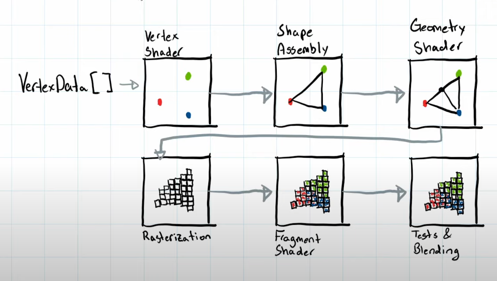
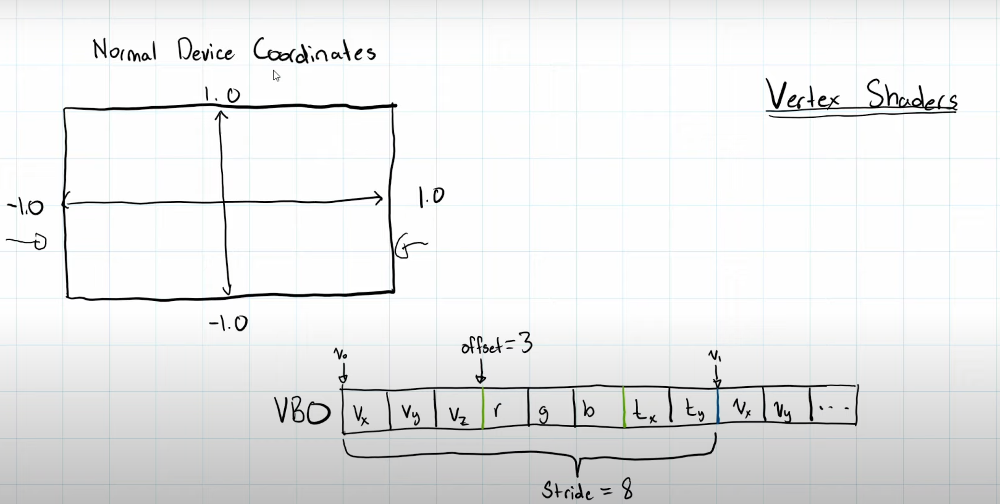
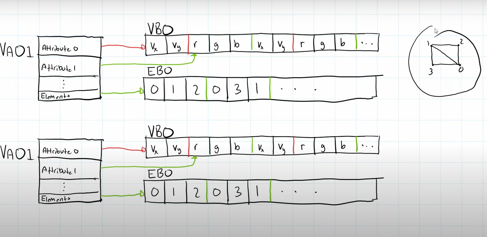
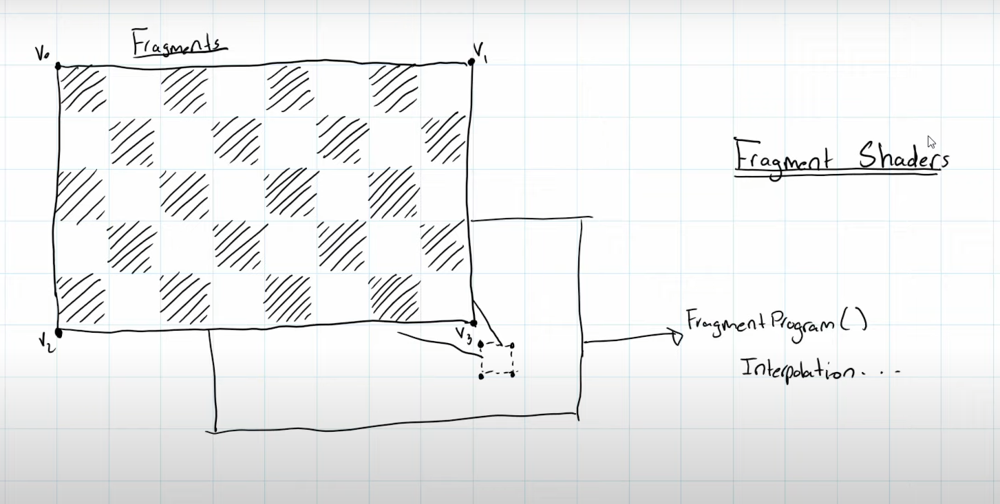
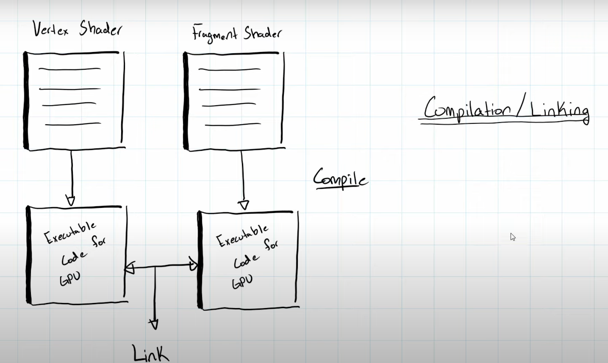

## [How GPU Programming works ](https://www.youtube.com/watch?v=TAXEND6xSYU&list=PLtrSb4XxIVbp8AKuEAlwNXDxr99e3woGE&index=5)

### Raster Graphics
In 70s to 80s, computer graphics is formatted in what's known as raster graphics. 
The process of which is basically jamming each pixel information in a flat array. The width
and the height are constrained.


```
Pixel pixelArray = [{r1, b1, g1}, {r2, b2, g2}];
```

Then they'll blit the array, basically just copy it to the screen since they don't have to 
worry about the length nor the size.

### Graphics Pipeline
There's a shift in modern graphics due to the need and want for 3D graphics. This promoted
us to change style to Modern Graphics, allowing for more advance and complex features.


Modern graphics sends shapes instead of Array. The way we're going to send them is through 
a set of vertices; With those vertices, we can form a triangle and thus everything else.

`Vertex Shader` [Programmable/Must] - This is one of the few process we can program, the vertex
shader tells us how to convert the vertices input into actual points in the screen. The purpose
of Vertex Shader is to normalize device coordinate. (World -> Projection -> Normalize to Computer)

`Shape Assembly` [Automatically] - `GL-TRI/POINT/STRIP` Build in function that converts the vertex
from just unrelated points to shape, which is indicated by the function above. There's various type
noted above.

`Geometry shader` [Programmable] - Most people really don't program this. Rare cases are 3D
stylize ocean. This shader adds more shape and vertex into an object.

`Rasterization` [Automatically] - Process of converting abstract shape into pixels that can
be display on the screen. 

`Fragment Shader` [Programmable/Must] - Defines functions to color your pixels, giving it more
stylization through programming instead of hand animation and creation. Ex. Lighting calculation,
PBR, Cartoon shader.

`Testing & Blending` [Atomically/Kind of] - We do have to tell GL how it's going to be display since
some object, like glass, are transparent and hence shouldn't obstruct view.

### Normal device 
Converts Vertices from some abstract coordinate to -1.0 to 1.0, in both dimension. This makes
easier for Graphics card to make calculation.

### Vertex Shader
*VBO*, User define information that will be passed into Vertex shader. There's an example of 
VBO in the bottom which shows how it'll function. You'll have to define the *Offset*, and *Stride*, which you can
observe more down below.



### VAO, EBO, VBO

`VAO` - Vertex Array Object. It's basically an object that contains all the parameters for
each shape; Think of them as a Square object containing the RGB in the Attribute 1 and so on. 

`EBO` - Element Buffer Object. Define index patterns to reduce duplication in line draw to
maximize efficiency.

You can create multiple VAO, but this is very  inefficient, so you want to group it in the 
future lecture (`Batching`)

### Fragment Shaders

Fragment Shader is like a big parallel process, for each pixel. This is how the chip and GPU 
does. `Fragment Shader` is the hardest to learn by far.

### Compilation/Linking

You want to tell which Vertex Shader and Fragment Shader to use. Think of it like linker, 
changing from Source code to Assembly to Object files and Link it. It's essentially the same
principle.

## External Resource
On eDX, there's fascinating course from UC San Diego, about Computer Graphics. Of which 
they not only mention algorithms for Computer graphics, but they also give more depth on
the actual history of Computer Graphics with algorithm developed through time.