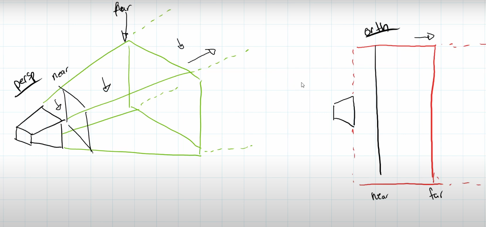

## [Camera Projection & View](https://www.youtube.com/watch?v=r857cbEtEY8&list=PLtrSb4XxIVbp8AKuEAlwNXDxr99e3woGE&index=8)

### Perspective and Orthogonal Camera
Orthogonal wouldn't increase the size of an object no matter the distances. This is not true
for Perspective as it's literally a perspective of the object. There's also clipping created by
the near and far. If the object is over or near a certain place; it'll be clipped.

### Matrix
We're using Homogenous Matrix; using View Matrix, with clipping matrix to transform object 
from world space to Matrix Space.

`Projection * View * Position`

Projection -> Projecting it onto a plane; onto our view.   
View -> How the Camera is Looking.  
Position -> Position of Camera.

**Probably have to Relearn this for Perspective**

### Camera Class

### Shader.java

### Default.glsl
More Detail next Video