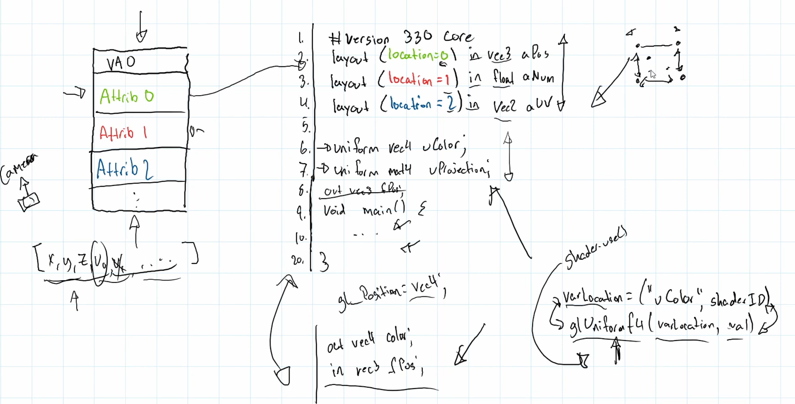

## [GLSL Shaders](https://www.youtube.com/watch?v=ouB6AdP9EaE&list=PLtrSb4XxIVbp8AKuEAlwNXDxr99e3woGE&index=9)
You would typically want one singular shader since Camera stays. `Uniform` doesn't change, it
communicates between object to object, and it retains it. So when you bind/unbind Shaders, you can
just update the VAO without changing the uniform.


Here it states that VAO is based on the GLSL layout, the location of which and the size of which. 
If there's an output of a Shader, there must be an input if it's in vertex shader. The Uniform
stays, hence there's multiple version, and you cannot use generic to make your life easier.

```java
public void uploadMat3f(String varName, Matrix3f matrix3f) {
        int varLocation = glGetUniformLocation(shaderProgramID, varName);
        use();
        FloatBuffer matBuffer = BufferUtils.createFloatBuffer(9);
        matrix3f.get(matBuffer);

        glUniformMatrix3fv(varLocation, false, matBuffer);
}

public void uploadVec4f(String varName, Vector4f vec) {
        int varLocation = glGetUniformLocation(shaderProgramID, varName);
        use();
        glUniform4f(varLocation, vec.x, vec.y, vec.z, vec.w);
}

public void uploadVec3f(String varName, Vector3f vec) {
        int varLocation = glGetUniformLocation(shaderProgramID, varName);
        use();
        glUniform3f(varLocation, vec.x, vec.y, vec.z);
}

public void uploadVec2f(String varName, Vector2f vec) {
        int varLocation = glGetUniformLocation(shaderProgramID, varName);
        use();
        glUniform2f(varLocation, vec.x, vec.y);
}

public void uploadFloat(String varName, float val) {
        int varLocation = glGetUniformLocation(shaderProgramID, varName);
        use();
        glUniform1f(varLocation, val);
}

public void uploadInt(String varName, int val) {
        int varLocation = glGetUniformLocation(shaderProgramID, varName);
        use();
        glUniform1i(varLocation, val);
}
```
The next important change is probably `default.glsl`, where we included a noise function.
```glsl
float noise = fract(sin(dot(fColor.xy, vec2(12.9898, 78.233))) * 43758.5453);
```